  <a href="mailto:warrierabhijith@gmail.com">Email</a> &middot;
  <a href="https://github.com/abhijithwrrr">GitHub</a> &middot;
  <a href="https://www.linkedin.com/in/abhijith-warrier/">LinkedIn</a> &middot;
  <a href="https://abhijithwrrr.github.io/">Website</a>

---

## Now

- **Building** &mdash; Bolt v2 (business-in-a-box for Indian power tool shops), plus a closed-testing helper for indie devs
- **Exploring** &mdash; Branching into web dev &mdash; hunting for a small productivity tool worth building
- **Reading** &mdash; *1984* by George Orwell. Reread. Still uncomfortably accurate
- **Open to** &mdash; Senior mobile roles, remote or hybrid, and freelance work

---

## About

Mobile developer with 4+ years of experience designing and deploying Android &amp; iOS applications using Kotlin, Jetpack Compose, Swift, and modern architectural patterns. I turn complex technical requirements into maintainable mobile systems that perform well in production.

My work has spanned reactive interfaces, online-offline data flows, Firebase-backed mobile services, iOS feature delivery, and IoT communication using USB and LoRa.

**Based** &middot; India &nbsp;&nbsp; **Experience** &middot; 4+ years &nbsp;&nbsp; **Platforms** &middot; Android, iOS &nbsp;&nbsp; **Focus** &middot; Architecture, IoT, offline-first

---

## GitHub Stats

<picture>
  <source media="(prefers-color-scheme: dark)" srcset="https://github-readme-stats.vercel.app/api?username=abhijithwrrr&show_icons=true&count_private=true&include_all_commits=true&hide_border=true&bg_color=0d1117&title_color=6C63FF&text_color=c9d1d9&icon_color=FF6584" />
  <source media="(prefers-color-scheme: light)" srcset="https://github-readme-stats.vercel.app/api?username=abhijithwrrr&show_icons=true&count_private=true&include_all_commits=true&hide_border=true&bg_color=f8f9fa&title_color=6C63FF&text_color=333&icon_color=FF6584" />
  
</picture>
<picture>
  <source media="(prefers-color-scheme: dark)" srcset="https://github-readme-stats.vercel.app/api/top-langs?username=abhijithwrrr&layout=compact&hide_border=true&bg_color=0d1117&title_color=6C63FF&text_color=c9d1d9&langs_count=6" />
  <source media="(prefers-color-scheme: light)" srcset="https://github-readme-stats.vercel.app/api/top-langs?username=abhijithwrrr&layout=compact&hide_border=true&bg_color=f8f9fa&title_color=6C63FF&text_color=333&langs_count=6" />
  
</picture>
<picture>
  <source media="(prefers-color-scheme: dark)" srcset="https://streak-stats.demolab.com?user=abhijithwrrr&hide_border=true&background=0d1117&ring=6C63FF&fire=FF6584&currStreakLabel=6C63FF&sideNums=c9d1d9&sideLabels=888&currStreakNum=c9d1d9&dates=555" />
  <source media="(prefers-color-scheme: light)" srcset="https://streak-stats.demolab.com?user=abhijithwrrr&hide_border=true&background=f8f9fa&ring=6C63FF&fire=FF6584&currStreakLabel=6C63FF&sideNums=333&sideLabels=666&currStreakNum=333&dates=999" />
  
</picture>

---

## Selected Work

### Bolt &mdash; *Power Tool Shop Management*

`In Production`

Complete business-in-a-box Android app for Indian power tool shops &mdash; rentals, repairs, inventory, customer CRM, and financial tracking with offline-first reliability. Includes a community-driven suspicious contact registry with auto risk-scoring.

**Stack:** Kotlin &middot; Compose &middot; MVVM + Hilt &middot; Room &middot; Firebase (Auth, Firestore, Crashlytics, Analytics, Remote Config) &middot; Coil &middot; CameraX &middot; Play Billing &middot; AdMob

[Google Play](https://play.google.com/store/apps/details?id=com.awbuilds.bolt) &middot; [Website](https://abhijithwrrr.github.io/bolt/)

### Hydra &mdash; *Smart Water Intake Tracker*

`In Production`

Gamified hydration tracking with animated Canvas water wave UI, XP and leveling system, streak tracking, weather-adaptive goals (via OpenWeatherMap + GPS), and full localization across 60+ locales.

**Stack:** Kotlin &middot; Compose &middot; Material 3 &middot; Clean Architecture &middot; Hilt &middot; Room &middot; Google Drive API &middot; Health Connect &middot; WorkManager + AlarmManager &middot; AdMob &middot; Play Billing

[Google Play](https://play.google.com/store/apps/details?id=com.awbuilds.hydra) &middot; [Website](https://abhijithwrrr.github.io/hydra/)

### ZenTask &mdash; *Gamified Productivity Suite*

`Closed Testing`

RPG-style task manager with 100 rank tiers across 11 titles (Zen Initiate through THE ZENITH), quadratic XP engine with streak multipliers, Pomodoro timer (4 presets), task dependencies, recurring tasks, and Google Drive cloud sync.

**Stack:** Kotlin &middot; Compose &middot; Material 3 &middot; Clean Architecture &middot; Hilt &middot; Room &middot; Google Drive API &middot; Firebase Auth + FCM + Remote Config &middot; AdMob &middot; Play Billing &middot; WorkManager

---

## Skills

**Languages** &middot; Kotlin &middot; Java &middot; Swift

**Android** &middot; Jetpack Compose &middot; Android SDK &middot; Material 3 &middot; Room &middot; DataStore &middot; WorkManager &middot; CameraX &middot; Coil

**iOS** &middot; Swift &middot; SwiftUI &middot; UIKit &middot; async/await &middot; URLSession &middot; Core Bluetooth &middot; TestFlight

**Architecture** &middot; MVVM &middot; MVI &middot; Clean Architecture &middot; Repository Pattern &middot; SOLID &middot; Hilt / Dagger

**Networking &amp; Cloud** &middot; Retrofit &middot; OkHttp &middot; Firebase &middot; REST APIs &middot; Google Drive API &middot; Cloudflare R2

**Concurrency** &middot; Coroutines &middot; Flow &middot; StateFlow &middot; RxJava

**IoT &amp; Hardware** &middot; USB Communication &middot; LoRa Protocols &middot; BLE &middot; Bluetooth &middot; Firmware Parsing

**Testing &amp; Delivery** &middot; JUnit &middot; Mockito &middot; Espresso &middot; XCTest &middot; XCUITest &middot; Compose UI Test &middot; CI/CD &middot; Git &middot; Firebase App Distribution

**Workflow** &middot; Android Studio &middot; Xcode &middot; Gradle &middot; Figma &middot; Postman &middot; Agile / Scrum

---

## Experience

| Period | Role | Company |
|---|---|---|
| Nov 2025 &mdash; Present | Mobile App Developer | Digitide Solutions Ltd. |
| Jun 2022 &mdash; Nov 2025 | Android App Developer | Primemover Solutions Pvt Ltd. |
| Sep 2021 &mdash; Nov 2021 | Data Annotator for AI | Digiyoda Media Pvt Ltd. |

---

## Education

| Period | Degree | Institution |
|---|---|---|
| 2019 &mdash; 2022 | Bachelor of Computer Applications | Bharathiar University |
| 2018 &mdash; 2020 | Bachelor of Arts in English | Rabindranath Tagore University |

**Certifications:** Android Development (Kotlin) &mdash; Internshala &middot; Android 12 &amp; Kotlin Masterclass &mdash; Udemy &middot; Flutter Development Bootcamp &mdash; Udemy

---

## Metrics

**4+** Years building mobile products &nbsp;&middot;&nbsp; **25%** Network latency cut on API flows &nbsp;&middot;&nbsp; **50%+** ANR drop via lifecycle &amp; death fixes &nbsp;&middot;&nbsp; **60+** Locales across shipped apps

---

## Contact

Open to senior mobile roles, architecture, or device-integrated app work.

  <a href="mailto:warrierabhijith@gmail.com">warrierabhijith@gmail.com</a> &middot;
  <a href="https://github.com/abhijithwrrr">GitHub</a> &middot;
  <a href="https://www.linkedin.com/in/abhijith-warrier/">LinkedIn</a> &middot;
  <a href="https://abhijithwrrr.github.io/Abhijith_Resume.pdf">Resume</a> &middot;
  <a href="https://abhijithwrrr.github.io/">Website</a>

  

---

Last updated June 2026
