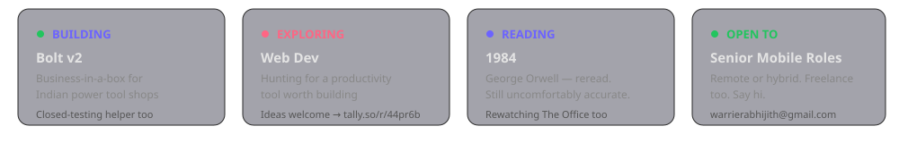
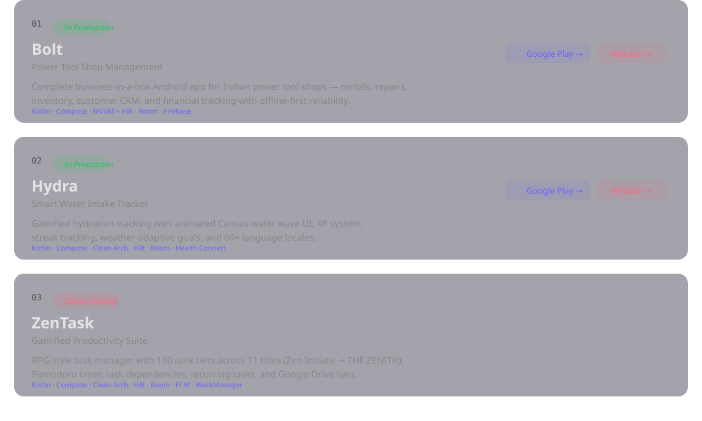

  <a href="mailto:warrierabhijith@gmail.com">Email</a> ·
  <a href="https://github.com/abhijithwrrr">GitHub</a> ·
  <a href="https://www.linkedin.com/in/abhijith-warrier/">LinkedIn</a> ·
  <a href="https://abhijithwrrr.github.io/">Website</a>

 

 

 

## GitHub Stats

<picture>
  <source media="(prefers-color-scheme: dark)" srcset="https://github-readme-stats.vercel.app/api?username=abhijithwrrr&show_icons=true&count_private=true&include_all_commits=true&hide_border=true&bg_color=0d1117&title_color=6C63FF&text_color=c9d1d9&icon_color=FF6584" />
  <source media="(prefers-color-scheme: light)" srcset="https://github-readme-stats.vercel.app/api?username=abhijithwrrr&show_icons=true&count_private=true&include_all_commits=true&hide_border=true&bg_color=f8f9fa&title_color=6C63FF&text_color=333&icon_color=FF6584" />
  
</picture>
<picture>
  <source media="(prefers-color-scheme: dark)" srcset="https://github-readme-stats.vercel.app/api/top-langs?username=abhijithwrrr&layout=compact&hide_border=true&bg_color=0d1117&title_color=6C63FF&text_color=c9d1d9&langs_count=6" />
  <source media="(prefers-color-scheme: light)" srcset="https://github-readme-stats.vercel.app/api/top-langs?username=abhijithwrrr&layout=compact&hide_border=true&bg_color=f8f9fa&title_color=6C63FF&text_color=333&langs_count=6" />
  
</picture>
<picture>
  <source media="(prefers-color-scheme: dark)" srcset="https://streak-stats.demolab.com?user=abhijithwrrr&hide_border=true&background=0d1117&ring=6C63FF&fire=FF6584&currStreakLabel=6C63FF&sideNums=c9d1d9&sideLabels=888&currStreakNum=c9d1d9&dates=555" />
  <source media="(prefers-color-scheme: light)" srcset="https://streak-stats.demolab.com?user=abhijithwrrr&hide_border=true&background=f8f9fa&ring=6C63FF&fire=FF6584&currStreakLabel=6C63FF&sideNums=333&sideLabels=666&currStreakNum=333&dates=999" />
  
</picture>

 

## Selected Work

  <a href="https://play.google.com/store/apps/details?id=com.awbuilds.bolt">Bolt on Google Play</a> ·
  <a href="https://abhijithwrrr.github.io/bolt/">Bolt Website</a> ·
  <a href="https://play.google.com/store/apps/details?id=com.awbuilds.hydra">Hydra on Google Play</a> ·
  <a href="https://abhijithwrrr.github.io/hydra/">Hydra Website</a>

 

## Skills

 

## Experience

 

## Education & Certifications

 

## Metrics

 

## Contact

  <a href="mailto:warrierabhijith@gmail.com">Email</a> ·
  <a href="https://github.com/abhijithwrrr">GitHub</a> ·
  <a href="https://www.linkedin.com/in/abhijith-warrier/">LinkedIn</a> ·
  <a href="https://abhijithwrrr.github.io/Abhijith_Resume.pdf">Resume</a> ·
  <a href="https://abhijithwrrr.github.io/">Website</a>

  

 

Last updated June 2026 · Profile README with SVG animations
